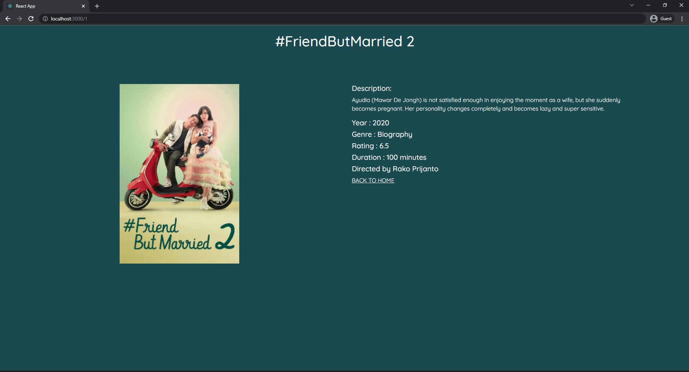

# Fullstack Web Application GDSC

## Description
> This project is a fullstack web application using react as frontend framework, express as backend framework, and supabase as database provider. This web app has many features, such as authorization functionality, home page displaying many movie data and its detail on dedicated page, and CRUD functionality for wishlists that will be explained more below. We connect the data with database so the data for wishlist will not be gone after exit the browser.

## Features
### Database connection
- We use supabase as database provider. Supabase provide free database storage. Therefore, here we use relational database with PosgreSQL as DBMS. We use three database tables for users, movies, and wishlists.

### Authorization
- We use email and password authentication that connected with the database. Users that has done login, will have credentials on their local storage that will be payload to get their own wishlist data. But for the sake of simplicity, we don't develop secure authorization. We only use user_id for the credentials on user's local storage.
### Home page and Detail page
- We also connect movies data with the database so updating the movies data can be sentralized even if user has clone the project long ago. We develop the routing using react router.

### CRUD functionality for wishlist
- For the users that has done login, they will be able to add and delete movie to their wishlists. The wishlists data is connected with the users data so even though user close their browser or login on different environtment, the wishlists data is preserved.

### 

## Setup
Because we use express as backend framework, you need to have node js and npm installed on your environment. We have provided `.env` file for database access, so you don't need to configure for the database connection.

## How To Run
- First you need to download or clone this repository
- Then open two terminals, one for running the client and one for running the server
- On the server run commands below
  ```sh
  cd server
  npm install
  npm run dev
  ```
- On the client run commands below
  ```sh
  cd client
  npm install
  npm start
  ```
- Open `localhost:3000` where frontend app is served and enjoy the app ^_^
  > But please be patient because we use free tier plan so data transaction is slow :D

## Display
- Here are some screenshots of our web application
### Home Page


### Detail Page

### Login and Register Modal


## Contributor
1. 120 - Malik Akbar Hashemi Rafsanjani
2. 127 - Hafidz Nur Rahman Ghozali